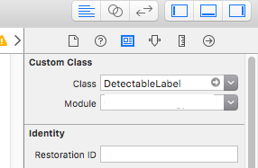
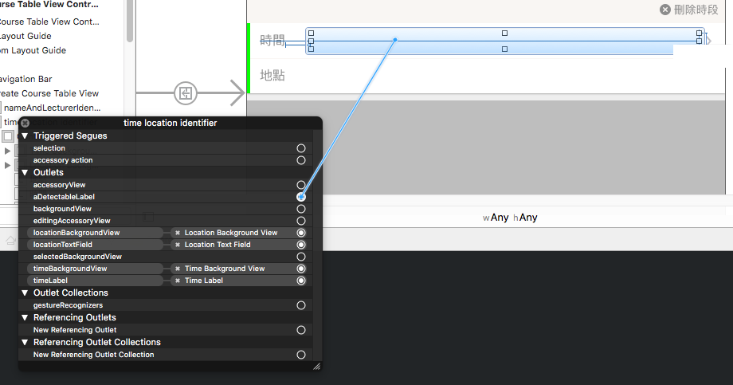

#Detectable Label
##A label that enables you to observe the change of its text.
可以偵測到text變化的label

###With Storyboard
####Declare first
declare a label, and dont forget the type DetectableLabel!.

```swift
@IBOutlet weak var aDetectableLabel: DetectableLabel!
```

####Subclass UILabel on Storyboard
always subclass


####Link the IBOutlet


###With Code
You can create a label by using initWithFrame:. It's the way that we were familar with.

```swift
var aDetectableLabel = DetectableLabel(frame: CGRectMake(0, 0, 10, 10))
```

###Getting Changed text
Here we will use delegate to get the changed text. After text changed, the delegate function `textChanging:text` will get called with a returning text.

So here, we have to assign the delegate to retrieve the returning text.

```swift
aDetectableLabel.delegate = self
```

## that's it, we are ready to go.

## License
`DetectableLabel` is released under an [MIT License][http://opensource.org/licenses/MIT]. See `LICENSE` for details.
>**Copyright &copy; 2016-present David Lin / yoxisem544.**